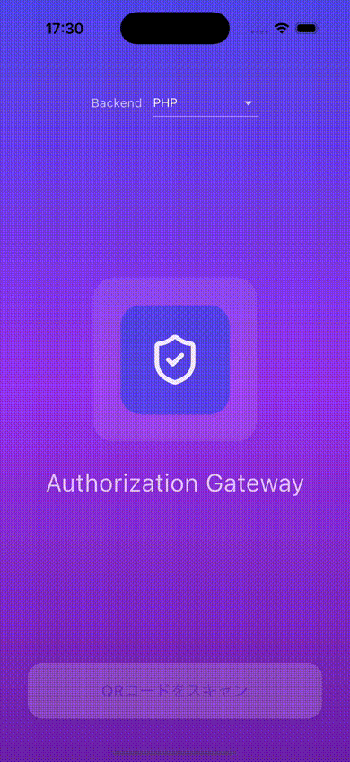
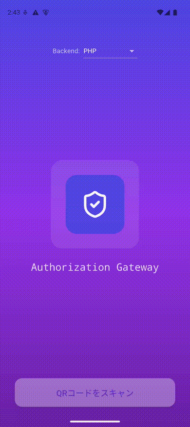

<p align="center">
<a href="https://flutter.dev/" target="_blank"></a>
&nbsp;&nbsp;
<a href="https://dart.dev/" target="_blank"></a>
&nbsp;&nbsp;
<a href="https://developer.apple.com/ios/" target="_blank"></a>
&nbsp;&nbsp;
<a href="https://developer.android.com/" target="_blank"></a>
</p>

<p align="center">
<a href="https://flutter.dev/"></a>
<a href="https://dart.dev/"></a>
<a href="https://developer.apple.com/ios/"></a>
<a href="https://developer.android.com/"></a>
</p>

---

#  Authorization Gateway Mobile

[認可サーバー](https://github.com/bobtabo/authorization) と連携する Flutter 製モバイルアプリです。  
担当者がクライアントを登録した後、クライアントが自身のAPIアクセスを利用開始・停止するための操作端末として機能します。  
アクセストークンの発行は認可サーバーが行います。

---

## :clipboard: 目次

- [デモ](#デモ)
- [画面構成](#画面構成)
- [技術スタック](#技術スタック)
- [開発環境構築](#開発環境構築)
  - [前提](#前提)
  - [セットアップ](#セットアップ)
  - [起動](#起動)
- [デモ録画・GIF 変換](#デモ録画gif-変換)
  - [自動操作版（推奨）](#自動操作版推奨)
  - [手動操作版](#手動操作版)
- [環境設定](#環境設定)
  - [API パス形式](#api-パス形式)
  - [API_ID の自動更新](#api_id-の自動更新)
- [ディープリンク](#ディープリンク)
  - [QRコードのURL形式](#qrコードのurl形式)
  - [ディープリンクのテスト](#ディープリンクのテスト)
- [セッション復元](#セッション復元)
- [Claude Code Hooks（自動化ルール）](#claude-code-hooks自動化ルール)
  - [自動化されている内容](#自動化されている内容)
  - [前提ツール](#前提ツール)
- [関連リポジトリ](#関連リポジトリ)

---

## :clapper: デモ

| iOS | Android |
|:---:|:---:|
|  |  |

---

## :iphone: 画面構成

| 画面 | 説明 |
|:---|:---|
| SplashScreen | 起動画面・QRスキャン開始ボタン |
| QRScannerScreen | カメラでQRコードをスキャン |
| ActivationConfirmScreen | クライアント情報の確認・利用開始実行 |
| TokenDisplayScreen | アクセストークン表示・コピー・シェア |
| HomeScreen | 利用状態確認・利用停止／再開操作 |

---

## :building_construction: 技術スタック

| 用途 | パッケージ |
|:---|:---|
| QRスキャン | `mobile_scanner` |
| ディープリンク（カスタムURLスキーム） | `app_links` |
| HTTP通信 | `http` |
| アニメーション | `flutter_animate` |
| SVG表示 | `flutter_svg` |
| シェア | `share_plus` |
| 環境設定 | `flutter_dotenv` |
| 永続化 | `shared_preferences` |

---

## :hammer_and_wrench: 開発環境構築

### 前提

- Flutter 3.41.9 以上
- Xcode（iOS ビルド）
- Android Studio / Android SDK（Android ビルド）
- `ffmpeg`（デモ録画の GIF 変換に使用。macOS では `brew install ffmpeg`）

> [!NOTE]
> iOS Simulator / Android エミュレーターのセットアップは各自で行ってください。

### セットアップ

```bash
git clone git@github.com:bobtabo/authorization-mobile.git
cd authorization-mobile

# 環境設定ファイルを作成
cp .env.example .env
flutter pub get

# 認可サーバーで tflocal apply 完了後に実行して API_ID を自動設定
bash scripts/update-env.sh
```

> [!IMPORTANT]
> `scripts/update-env.sh` は認可サーバー（`../authorization`）で `tflocal apply` 実行済みであることが前提です。
> 認可サーバーのセットアップが未完了の場合は、先に [bobtabo/authorization](https://github.com/bobtabo/authorization) の手順を済ませてください。

### 起動

**エミュレーター／シミュレーターの起動**

```bash
# Android（Pixel 9 / API 35）
~/Library/Android/sdk/emulator/emulator -avd Pixel_9_API35_Camera &

# iOS Simulator
open -a Simulator
```

**アプリの起動**

```bash
# 接続デバイスを確認
flutter devices

# デバイスを指定して起動
flutter run -d emulator-5554   # Android
flutter run -d iPhone          # iOS Simulator
```

---

## :movie_camera: デモ録画・GIF 変換

デモ操作の録画から GIF 変換までを一発で行うスクリプトを用意しています。
用途に応じて **自動操作版** と **手動操作版** の 2 種類があります。

出力は iOS / Android で別ディレクトリに分かれます。

| 出力 | 説明 |
|:---|:---|
| `docs/ios/demo.mp4` | iOS 録画ファイル（中間・`.gitignore` 対象） |
| `docs/ios/demo.gif` | iOS 変換後 GIF（README / Notion 掲載用） |
| `docs/android/demo.mp4` | Android 録画ファイル（中間・`.gitignore` 対象） |
| `docs/android/demo.gif` | Android 変換後 GIF（README / Notion 掲載用） |

実際のデモ映像は先頭の [デモ](#デモ) セクションに掲載しています。

### 自動操作版（推奨）

`integration_test` でデモ操作（QRスキャン → クライアント情報確認 → 利用開始 →
アクセストークン表示 → ホーム画面でステータス確認）を**自動再生**しながら録画し、
GIF まで変換します。人手での操作は不要です。

```bash
# iOS Simulator（事前に open -a Simulator で起動しておく）
bash scripts/record-demo-auto.sh ios

# Android エミュレーター（事前にエミュレーターを起動しておく）
bash scripts/record-demo-auto.sh android

# デバイスIDを明示指定することも可能（省略時は起動中の端末を自動検出）
bash scripts/record-demo-auto.sh android emulator-5554
```

> [!IMPORTANT]
> このデモは**実サーバー（LocalStack / ngrok / 実バックエンド）に一切接続しません**。
> API 応答（クライアント情報・アクセストークン）はすべて `MockClient` でモックするため、
> 認可サーバーのセットアップや `.env` の設定なしで実行できます。

> [!NOTE]
> エミュレーター/シミュレーターには実カメラがないため、`scripts/record-demo-auto.sh` は
> `--dart-define=DEMO_SCAN_PREVIEW=true` を付与し、スキャナー画面に実機カメラの代わりに
> サンプル QR コード（`assets/demo_qr.png`）をプレビュー表示します。これにより録画に
> 実在の部屋（エミュレーターの仮想シーン）が映り込まず、「QR コードを読み取っている」
> 様子を再現できます。このフラグは録画時のみ有効で、本番ビルド（既定 `false`）の
> カメラ動作には一切影響しません。

デモシナリオの実体は [`integration_test/demo_scenario_test.dart`](integration_test/demo_scenario_test.dart) です。
録画なしでシナリオだけを実行・確認することもできます。

```bash
flutter test integration_test/demo_scenario_test.dart -d <device-id>
```

### 手動操作版

録画を開始し、自分でアプリを操作して **Enter キー**で停止すると GIF に変換されます。
自動シナリオに含まれない操作（利用停止など）を録画したい場合に使います。

```bash
# iOS Simulator を録画（事前に open -a Simulator で起動しておく）
bash scripts/record-demo.sh ios

# Android エミュレーターを録画（事前にエミュレーターを起動しておく）
bash scripts/record-demo.sh android
```

> [!NOTE]
> どちらも `ffmpeg` が必要です（macOS では `brew install ffmpeg`）。
> GIF のサイズが大きい場合は `FPS=8 SCALE_WIDTH=320 bash scripts/record-demo-auto.sh ios` のように調整できます。

---

## :gear: 環境設定

`.env` でバックエンドの接続先を管理します。

```env
BASE_URL=https://ample-precise-knee.ngrok-free.app
API_ID={api-id}
```

| 変数 | 説明 |
|:---|:---|
| `BASE_URL` | ngrok 固定ドメイン（認可サーバーの API Gateway へのプロキシ）。**各自の ngrok ドメインに変更してください。** |
| `API_ID` | LocalStack API Gateway の REST API ID（`tflocal apply` で生成される） |

> [!NOTE]
> `STAGE` は `local` 固定のためアプリ内にハードコードされています。`.env` での設定は不要です。

### API パス形式

LocalStack API Gateway のパス形式は以下のとおりです。

```
/restapis/{api-id}/local/_user_request_/function/{slug}/api
```

アプリ内のバックエンド切替プルダウンで、接続先スラッグ（`{slug}`）を変更できます。

### API_ID の自動更新

認可サーバー側で `tflocal apply` を実行した後、以下のスクリプトで `.env` の `API_ID` を自動更新できます。

```bash
bash scripts/update-env.sh
```

> [!NOTE]
> スクリプトは認可サーバーの Terraform ディレクトリ（`../authorization/terraform/local`）から `tflocal output -raw api_gateway_id` で取得します。
> ディレクトリ配置が異なる場合は環境変数 `AUTH_TERRAFORM_DIR` で上書きしてください。

---

## :link: ディープリンク

カスタムURLスキーム `authgateway://` を使用します。外部QRスキャナーアプリでQRコードを読み取ると、本アプリが自動起動します。

| プラットフォーム | 方式 | 設定ファイル |
|:---|:---|:---|
| iOS | カスタムURLスキーム | `ios/Runner/Info.plist` |
| Android | カスタムURLスキーム | `android/app/src/main/AndroidManifest.xml` |

### QRコードのURL形式

```
authgateway://clients/{identifier}/info
```

### ディープリンクのテスト

```bash
# Android
adb shell am start -a android.intent.action.VIEW -d "authgateway://clients/{identifier}/info"

# iOS Simulator
xcrun simctl openurl booted "authgateway://clients/{identifier}/info"
```

---

## :arrows_counterclockwise: セッション復元

利用開始した端末はローカルにクライアント識別子を保存します。  
次回起動時にバックエンドへステータスを確認し、利用中／停止中であればホーム画面へ直行します。

| 状態 | 起動時の遷移先 |
|:---|:---|
| 利用中 / 停止中 | ホーム画面 |
| 未利用 / セッションなし | スプラッシュ画面 |

---

## :robot: Claude Code Hooks（自動化ルール）

[Claude Code](https://docs.claude.com/en/docs/claude-code/hooks) の Hooks 機能を使い、このリポジトリでの定型作業を自動化しています。設定はプロジェクト共有の [`.claude/settings.json`](.claude/settings.json) にあり、リポジトリに含まれます。個人設定 `.claude/settings.local.json`（Bash/MCP の許可リスト等）は `.gitignore` で除外されたままです。

Hooks はローカルでの対話的な Claude Code 利用時のみ発火します。CI（`.github/workflows/ci.yml`）とは無関係です。

### 自動化されている内容

| イベント | 対象 | 挙動 |
|:---|:---|:---|
| PostToolUse | `Edit`/`Write`（`.dart`） | 保存直後に `dart format` で自動整形 |
| PreToolUse | `Edit`/`Write`（`*.g.dart`/`*.freezed.dart`） | 生成ファイルへの直接編集を拒否 |
| PreToolUse | `Bash` | `git push --force` / `reset --hard` / `branch -D` / `clean -f` 等の破壊的操作を拒否 |
| PreToolUse | `Bash`（`git commit`） | コミット前に機密情報をチェック（`gitleaks` 優先、未導入時は簡易 grep フォールバック） |
| Stop | ― | 実装完了時に `dart fix --apply` → `dart format .` でインポート最適化を一括実行 |
| Stop | ― | 完了のデスクトップ通知（macOS の `osascript` のみ。無い環境では何もしない） |

インポート最適化を編集の都度ではなく Stop（実装完了時）にまとめて実行するのは、`dart fix --apply` がプロジェクト全体を解析するため、編集ごとに走らせると開発体験を損なうためです。

### 前提ツール

- **`jq`**（必須）: フックが標準入力の JSON を解析するために使用します。
  - macOS: `brew install jq`
  - Debian/Ubuntu: `sudo apt-get install -y jq`
- **`gitleaks`**（任意・推奨）: コミット前の機密情報チェックに使用します。未導入の場合は簡易 grep によるフォールバックが働きます。
  - macOS: `brew install gitleaks`
  - その他: [公式リリース](https://github.com/gitleaks/gitleaks/releases)を参照

---

## :books: 関連リポジトリ

| リポジトリ | 説明 |
|:---|:---|
| [bobtabo/authorization](https://github.com/bobtabo/authorization) | 認可サーバー（OAuth2/OIDC）・管理画面 |
| bobtabo/authorization-mobile | 本リポジトリ：クライアント操作用モバイルアプリ |
